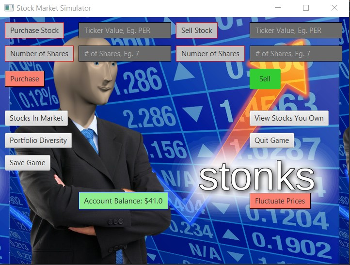
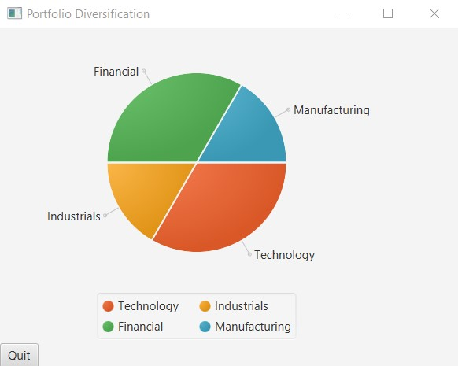
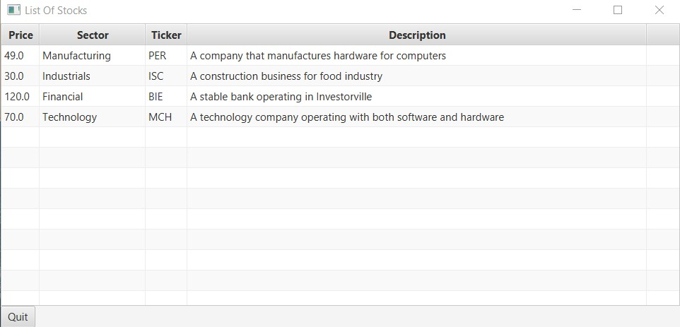

# Stock Market Simulator

### A simulation with an overly-simplified economy

This application will provide the user with virtual currency to "invest" 
in the stock market of fantasy country called "InvestorLand."

### About
There are five sectors in InvestorVille: Energy, Technology, Aerospace & Defence, Consumer Discretionary
and HealthCare. Each sector is related to each other and fluctuations in one can impact the other. You are able to
progress through time and receive "updates" on events in the stock market. From here you will make decisions
on what stock to buy or sell. There will be a total of 30 stocks distributed among the five sectors.   

### Program Benefits
The program greatly simplifies an real economy and allows people to gain a deeper understanding on how
events can affect various sectors.

### Why?
As a student with strong interests in both finance and software engineering, this project will allow to
develop my skills in both these areas and further my understanding in them

#### User Stories:
- As a user, I want to be able to buy a stock and update my balance
- As a user, I want to be able to sell a stock and update my balance
- As a user, I want to be able to see a list of stocks in the market

- As a user, I want to be able to see a list of stocks I own
- As a user, I want to be restricted from buying stocks out of my budget
- As a user, I want to be restricted from selling stocks I do not own

- As a user, I want to be able to save my status in the game (the stocks I own and account balance)
- As a user, I want to be able to continue to play where I left off

- As a user, I want to see a graphical user interface of elements in the game
- as a user, I want to see the audiovisual component of a piechart to represent portfolio diversification
- as a user, I want to save the file using buttons and load the file when I begin

## PHASE 4: TASK 2
- I chose to test and design a class that is robust. I chose the class "Stocks in Market". The method 
findStockFromTicker throws the exception and it is tests. The method get stock also throws an exception. All methods
do not throw any run time exceptions if called with invalid parameters.
- I also chose to include a type hierarchy in my code. The abstract class is PopUp, and its two subclasses are alert
and confirm. They both override tha abstract method PopUp and implement it in their own distinct ways

## PHASE 4: TASK 3
- The alert class in the graphics package has lost cohesion. It creates alert boxes, but also PieCharts and tables. 
As a result, I  will follow the single responsibility principle and create two new classes, PieChart and StockTable.
- I discovered there was unnecessary coupling as the GUI did not need to know about both the "Confirm" and "Alert" 
classes, it just needed to  know about the abstract "PopUp" class
- Another issue I found was that there was too much cohesion in my StockTable class - I was creating two distinct 
tables with somewhat different information. As a result, I decided to create an interface called Stock Table and had
both MarketStocks and OwnedStocks implement the method "display market stocks"

